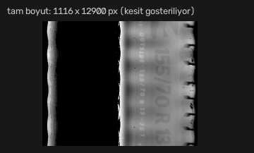
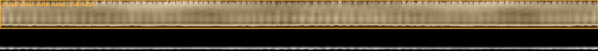
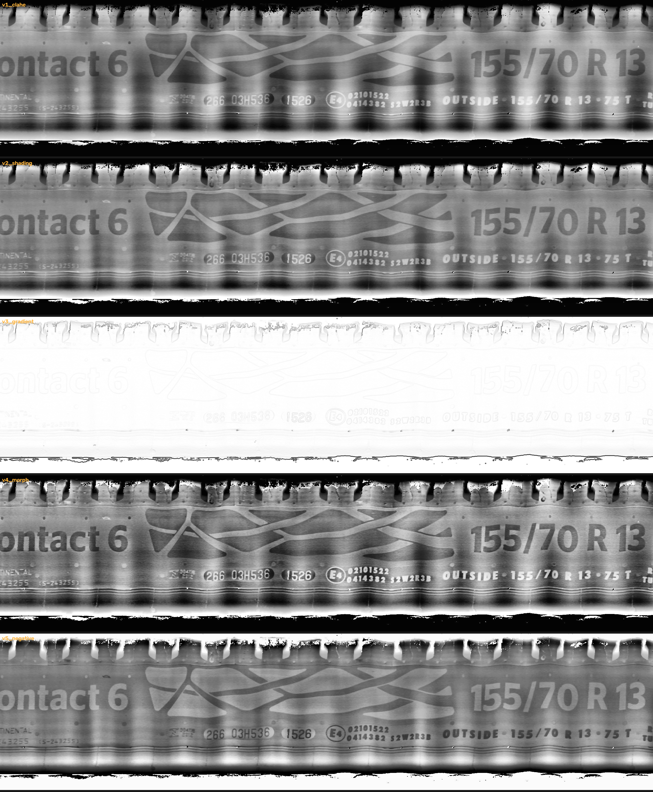
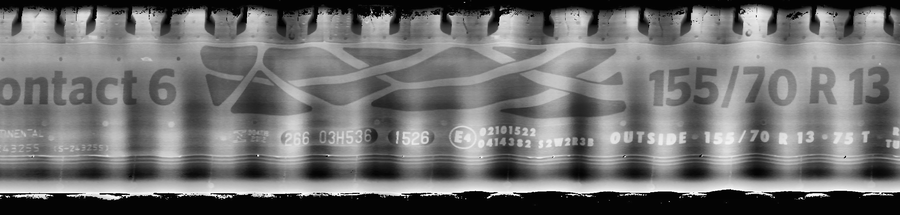
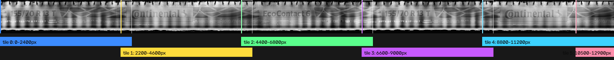
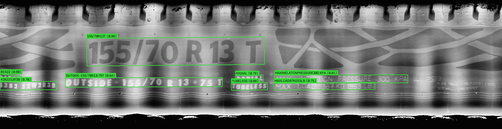
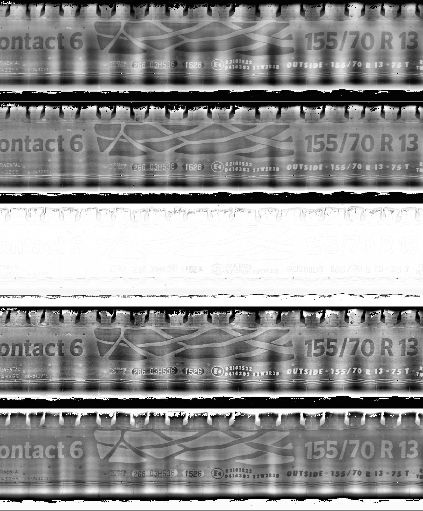

# Tire Sidewall OCR 

An end-to-end, **fully local/offline** OCR pipeline + visual web interface that extracts
structured information from line-scan tire images (**low-contrast embossed sidewall lettering**).

Developed during an internship: validated on 119 tires (238 images), delivered with
engine/variant benchmarks and a feasibility report.


---

## Why this is a strong project

- **Solves a real problem:** embossed tire lettering is one of the hardest targets for classical OCR
  (low contrast, light/shadow dependence, curved surface). Running a generic OCR engine on it
  directly yields **~0% usable output** — this project overcomes that with engineering.
- **Measurement-driven engineering:** 3 OCR engines × 5 preprocessing variants compared on a labeled
  set, winners picked from data. Two R&D rounds took accuracy from **56.3% → 63.2%** (30-tire set),
  with an alternative configuration at **71.8%**.
- **Real speedup:** after moving to GPU, RapidOCR got **3.1×** faster and EasyOCR **6.4×** faster;
  the two-engine ensemble ended up **faster than the single engine on CPU** (19.0 s/tire).
- **One-command demo:** no setup hassle thanks to the Docker image — `docker compose up` starts the
  web UI, you pick photos and see step-by-step results.
- **Built with production in mind:** quality gate (rejects empty captures), confidence scores,
  "stay silent when unsure" policy, modular engine/variant architecture, full report and
  concrete next steps included.

---

## In action — real outputs

The images below are the pipeline's step-by-step output on a real tire (`Ust_5.jpg`,
Continental EcoContact 6). On this tire the system correctly read **7 of 8 key fields**
(size, speed rating, brand, pattern, season, DOT, tubeless).

### 1. Raw image → text-band detection

| Raw image (representative crop, full size 1116×12900 px) | Detected text band (622 px) |
|---|---|
|  |  |

Automatic orientation (two 180° candidates voted by OCR-confidence score) + background cropping via
row-brightness profile. Empty/failed captures are rejected by the quality gate (correctly triggered
on 11/119 upper images).

### 2. Contrast enhancement — 5 variants



`v1_clahe` · `v2_shading` (illumination correction) · `v3_gradient` (emboss edges) ·
`v4_morph` (morphological) · `v5_negative`. No single variant wins on every field — hence
ensemble voting. Single crop after cropping:



### 3. Tiling — the key technical finding



Feeding the strip (~20:1 aspect ratio) directly to the engine makes RapidOCR **skip detection
entirely** (0 boxes) — caused by the `width_height_ratio` threshold (default 8). Fix: split into
overlapping tiles (safety margin of `band_height × 6`). This fix took reading from zero back to normal.

### 4. OCR boxes + field extraction



Sample raw reads: `155/70R13T` (0.88) · `RADIAL` (0.78) · `OUTSIDE-155/70R13·75T` (0.84) ·
`TUBELESS` (0.88). Converted into 9 fields via regex + dictionary (rapidfuzz fuzzy matching),
then fused with **weighted voting** across sidewall × tile × variant × engine sources.

### 5. Variant comparison (3 sample tires)



---

## Results (119 tires, verified on a 30-tire labeled set)

| Configuration | Time (119 tires) | s/tire | Accuracy (30-GT, 8-field avg.) |
|---|---|---|---|
| Phase 0: RapidOCR+EasyOCR, GPU (first ensemble) | 39.6 min | 20.0 | 56.3% |
| **Phase 1: + lexicon/consistency/DOT fixes (selected)** | **37.7 min** | **19.0** | **63.2%** |
| PP-OCRv6 single engine (high-accuracy alternative) | 107.2 min | 54.1 | 71.8% |

Per field (selected configuration):

| Field | Accuracy (30-GT) | Coverage (119 tires) |
|---|---|---|
| Brand | 80% | 92% |
| Pattern | 58% | 88% |
| Size | 72% | 81% |
| Speed rating | 52% | 68% |
| Season | 65% | 78% |
| DOT (production date) | 73% | 77% |
| Made in | 30% | 45% |
| Tube type | 76% | 88% |

Engine comparison (9 tires, fixed variant): **RapidOCR** (272 s) matches EasyOCR accuracy but is
**3× faster**; Tesseract is practically unusable on embossed text (0–11%). Details:
[`docs/RAPOR.md`](docs/RAPOR.md) (Turkish).

---

## Quick start

### Option A — Docker (recommended, zero setup)

```bash
git clone https://github.com/yavuzzaltay/LastikOCR.git
cd LastikOCR

# Put your own tire photos in these folders:
#   Lastik_fotolari/Lastigin_ustu/Ust_1.jpg, Ust_2.jpg, ...
#   Lastik_fotolari/Lastigin_alti/Alt_1.jpg, Alt_2.jpg, ...

docker compose up --build
```

Open **http://localhost:5000** — select photos, hit process, see step-by-step visuals +
extracted fields + timing. Details: [`docs/DOCKER.md`](docs/DOCKER.md) (includes GPU run).

### Option B — Local Python

```bash
pip install -r requirements.txt   # without GPU: requirements-docker.txt is recommended

python src/webapp.py              # web UI → http://127.0.0.1:5000
python src/benchmark.py           # engine × variant comparison (labeled set)
python src/run_all.py             # process all 119 tires → results/sonuclar.csv
python src/run_all.py --engines=rapidocr_v6 --variants=v1_clahe  # PP-OCRv6 alternative
```

> Note: `Lastik_fotolari/` (~350 MB) is git-ignored and not in the repo. You can run it with your
> own images using the same file names (`Ust_N.jpg` / `Alt_N.jpg`).

---

## Project structure

```
LastikOCR/
├── src/
│   ├── preprocess.py      # orientation, quality gate, band crop, 5 variants
│   ├── tiling.py          # overlapping tiling (fixes the width/height-ratio trap)
│   ├── engines/           # unified interface: rapidocr, rapidocr_v6, easyocr, tesseract
│   │   └── base.py        # automatic GPU detection (gpu_available)
│   ├── extract.py         # regex + fuzzy-dictionary field extraction
│   ├── lexicon.py         # brand/pattern/season dictionaries
│   ├── fuse.py            # multi-source weighted voting + brand↔pattern consistency
│   ├── pipeline.py        # end-to-end pipeline (shared by benchmark + run_all + webapp)
│   ├── scoring.py         # ground-truth comparison
│   ├── benchmark.py       # engine × variant comparison
│   ├── run_all.py         # full-dataset run (automatic config selection)
│   ├── vlm.py             # local VLM experiment (Qwen2.5-VL, fallback proposal)
│   ├── webapp.py          # Flask UI (photo selection + step-by-step visualization)
│   ├── templates/         # web UI templates
│   ├── gen_pipeline_walkthrough.py  # generates the step images used in this README
│   └── gen_debug_images.py          # generates sample variant images
├── tests/
│   └── test_preprocess_manual.py    # quick visual verification
├── data/
│   └── ground_truth.csv   # 30-tire labeled set
├── results/
│   ├── sonuclar.csv       # 119-tire output of the selected configuration
│   ├── benchmark_results.csv / benchmark_log.json
│   ├── rapor.md / rapor.html       # full feasibility report (Turkish)
│   ├── debug/pipeline/    # step-by-step images + walkthrough.json
│   └── archive/           # intermediate configuration outputs
├── docs/
│   ├── RAPOR.md           # feasibility report copy (Turkish)
│   └── DOCKER.md          # running with Docker, CPU + GPU (Turkish)
├── assets/screenshots/    # README images
├── Dockerfile / Dockerfile.gpu / docker-compose.yml / docker-compose.gpu.yml
└── requirements.txt / requirements-docker.txt / requirements-gpu.txt
```

---

## Method (short)

1. **Orientation:** portrait/landscape + 180° ambiguity resolved by voting two candidates with OCR-confidence scores.
2. **Quality gate:** no band in the row-brightness profile → `UNREADABLE` (filters empty captures).
3. **Band crop + 5 contrast variants** (CLAHE, illumination correction, gradient, morphology, negative).
4. **Overlapping tiling** to fit OCR engines' input size.
5. **3 OCR engines** (RapidOCR, EasyOCR, Tesseract) + PP-OCRv6 alternative behind one interface.
6. **Field extraction:** regex (size, DOT, made-in, tube type) + fuzzy dictionary (brand, pattern) + 3-source season.
7. **Fusion:** weighted voting by confidence + recurrence, with brand↔pattern consistency penalty.

---

## Known limitations & next steps

- **DOT** is the hardest field: oval-stamp detection (Hough circles) + targeted high-resolution OCR recommended.
- **Lexicon expansion** is the cheapest win: import the full brand/pattern list from inventory.
- **VLM fallback:** Qwen2.5-VL read perfectly on the right crop (DOT included) — proposed as a targeted
  fallback for fields classical OCR leaves blank, not as a full pipeline.
- On the physical side, **raking (oblique) lighting** is the single change that would boost contrast most.

Full analysis: [`docs/RAPOR.md`](docs/RAPOR.md) (Turkish).

---

## License

MIT — see `LICENSE`.
